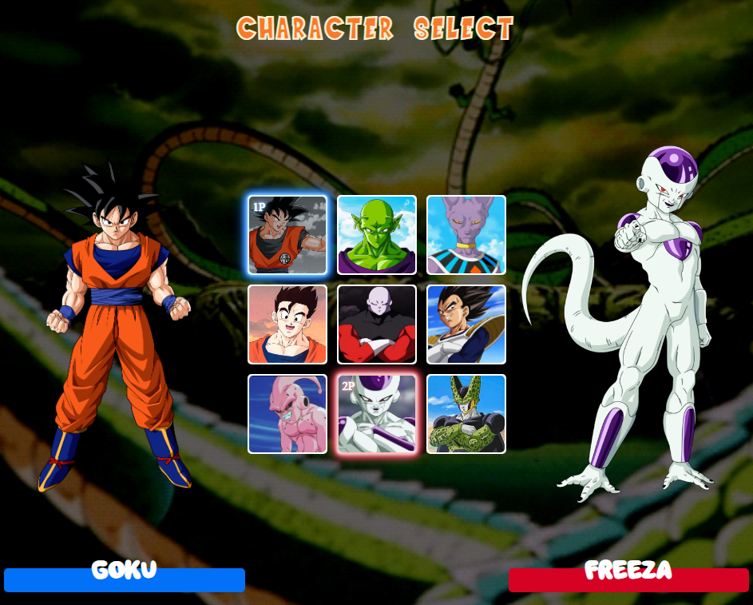

<h1 align="center">
  💻 Dragon Ball
</h1>

<h4 align="center"><a href="https://lucasgabriell97.github.io/dragonball/">Clique para visitar o projeto</a></h4>

## 📚 Sobre o projeto

Desenvolvido no evento MAPADEV WEEK.
O projeto simula um menu de seleção de personagens semelhante aos jogos de luta, e a minha resolução foi feita com o tema Dragon Ball. 

## 💼 Tecnologias utilizadas

- HTML;
- CSS;
- JavaScript;
