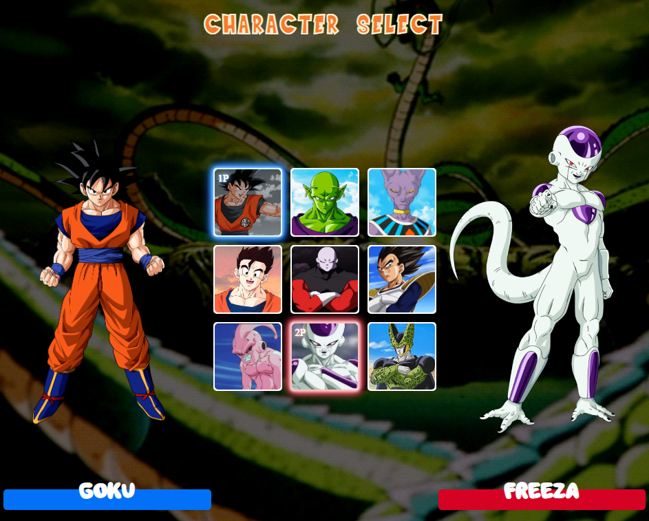

<h1 align="center">
  💻 Dragon Ball
</h1>

  

<h4 align="center"><a href="https://dragonball-zeta.vercel.app/">Clique para visitar o projeto</a></h4>

## 📚 Sobre o projeto

Desenvolvido no evento <strong>MAPADEV WEEK</strong>, simula um menu de seleção de personagens semelhante aos jogos de luta, e a minha resolução foi feita com o tema Dragon Ball. 

## 🛠️ Tecnologias utilizadas

- HTML;
- CSS;
- JavaScript;
